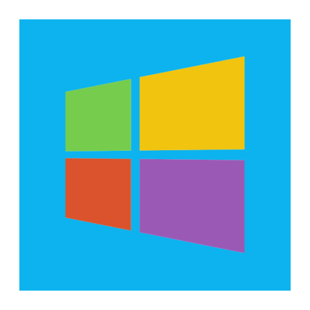
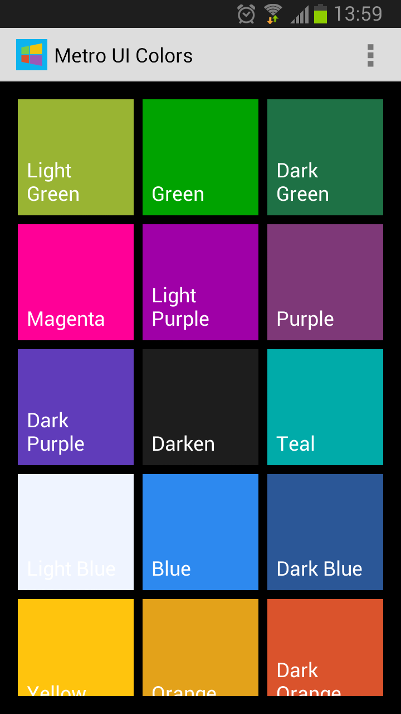
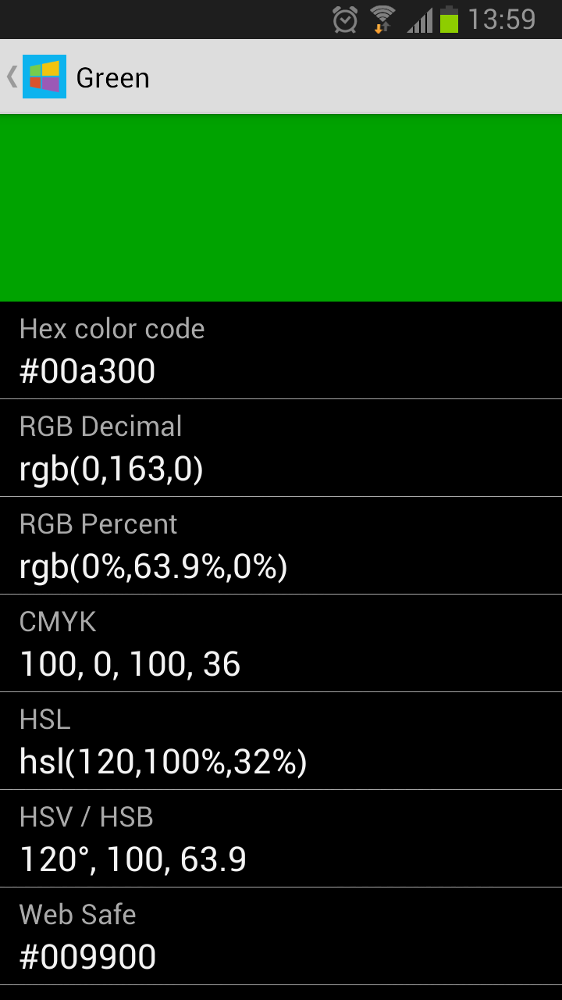

# 磁贴界面颜色（Metro UI Color）

##介绍
* 包含了磁贴界面（Metro UI）使用的颜色集合（浅绿色，绿色，深绿色，品红，紫色等）。可以查看每一种颜色的各种值（RGB，CMYK，HSL等）
* Color set (light green, green, dark green, magenta, purple, etc.) Metro UI used. You can view various values ​​of each color (RGB, CMYK, HSL, etc.)

##功能
* 磁贴界面（Metro UI）使用的颜色集合。
* 每一种颜色的各种值（RGB，CMYK，HSL等）
* 支持中英文。

##截图

